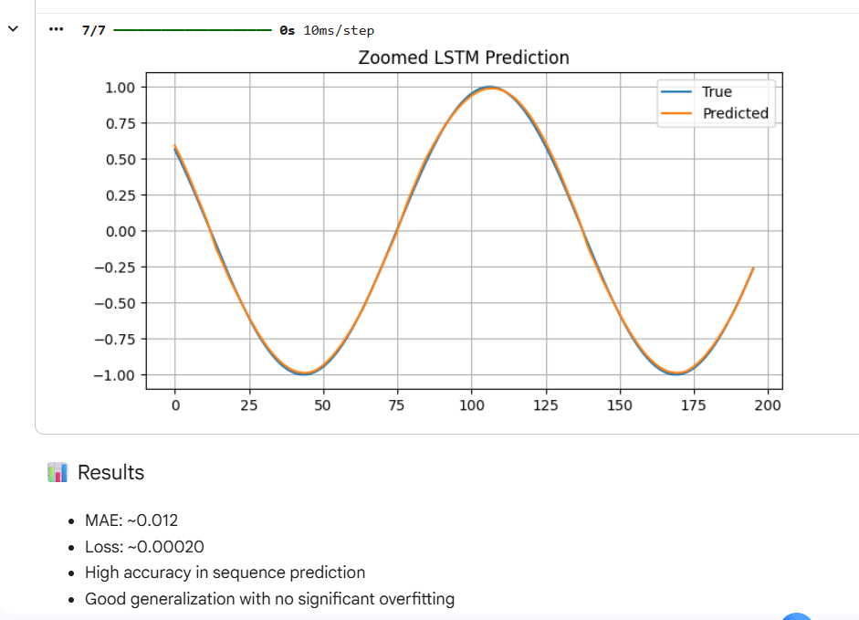
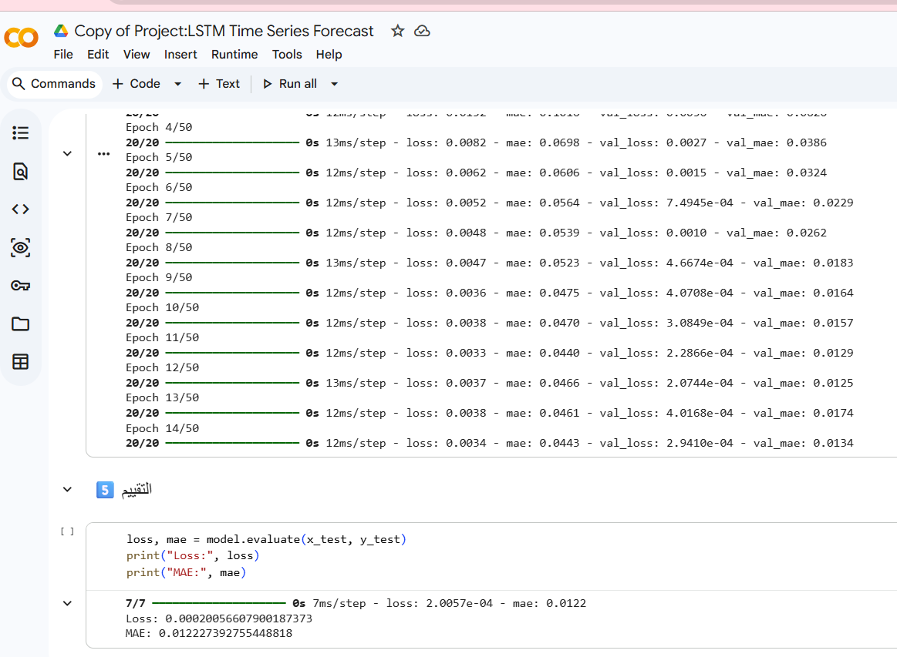
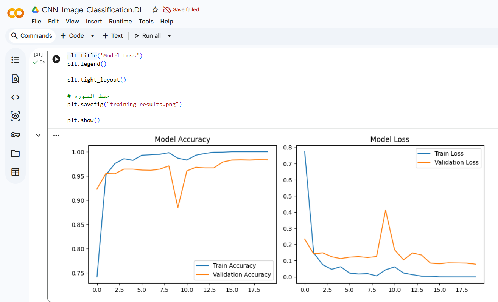
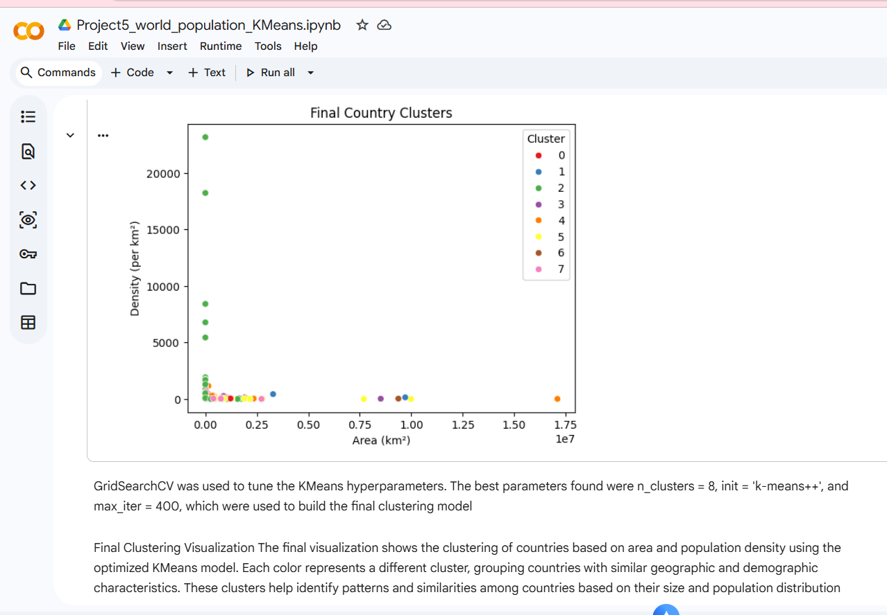
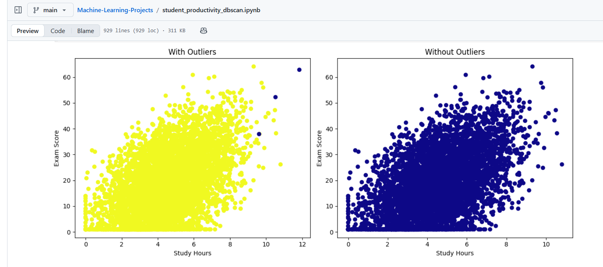

# Machine Learning Projects

This repository contains multiple Machine Learning and Data Science projects implemented using **Python** and **R**.

---

## 📌 Projects Overview

---

## 1️⃣ Time Series Forecasting using LSTM Neural Network (🔥 Main Project)

This project uses **LSTM (Long Short-Term Memory)** to predict time series values generated from a sine wave dataset.

### 🛠️ Methodology
- Data generation (sine wave)
- Sliding window technique
- Data preprocessing
- LSTM model building
- Training & validation
- Prediction visualization

### 🧠 Model Architecture
- LSTM layer
- Dropout layer
- Dense layers

### 📊 Results
- MAE: ~0.012  
- MSE: ~0.00020  
- High accuracy in capturing time series patterns  
- Predictions closely match true values  

### 📁 Files
`LSTM_Time_Series_Forecasting.ipynb`

### 📈 Visual Results

---

## 2️⃣ Image Classification using CNN

This project implements an image classification model using **Convolutional Neural Networks (CNN)** with TensorFlow and Keras.

### 🛠️ Technologies
- Python
- TensorFlow
- Keras
- NumPy
- Matplotlib
- Google Colab

### 📁 File
`CNN_Image_Classification.ipynb`
### 📊 CNN Results

---

## 3️⃣ World Population Clustering using KMeans

This project applies **KMeans clustering** to group countries based on demographic features.

### 🛠️ Techniques Used
- Data cleaning
- Encoding
- Elbow method
- KMeans clustering
- Visualization

### 📊 Clustering Results
Countries were grouped into meaningful clusters based on population characteristics.

---

## 4️⃣ Student Performance Prediction (Regression)

This project predicts student performance using multiple regression models.

### 🛠️ Models Tested
- Linear Regression
- Random Forest
- Gradient Boosting

### 📊 Result
Linear Regression performed best based on R², MAE, and RMSE.

### 📁 File
`Student_Performance_Prediction.ipynb`

---

## 5️⃣ Student Productivity Analysis using DBSCAN

This project analyzes student productivity patterns using DBSCAN clustering.

### 🛠️ Methodology
- Data preprocessing  
- Feature scaling  
- DBSCAN clustering  
- Visualization  

### 📊 DBSCAN Clustering Results
Identified distinct student behavior clusters.

---

## 6️⃣ Boston Housing Price Prediction

This project predicts housing prices using regression techniques on the Boston Housing dataset.

### 🛠️ Techniques Used
- Data exploration  
- Outlier detection  
- Correlation analysis  
- Linear regression  
- Feature selection (stepAIC)  
- VIF check  
- Robust regression  

### 📊 Result
The model achieved **R² ≈ 0.74**

### 📁 File
`Boston_Housing_Prediction.R`

---

## 🔥 Author
**Sabrin Kater**
