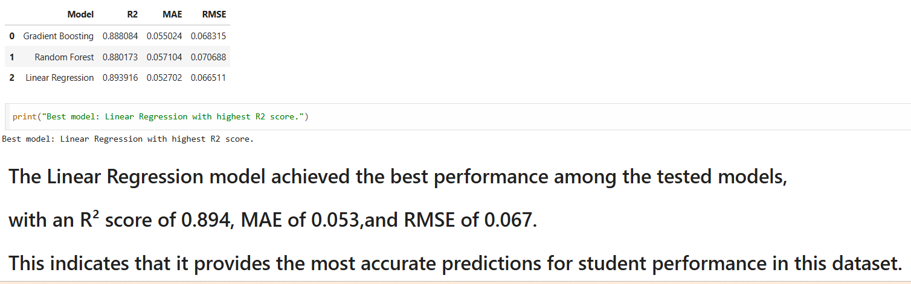

# 🧠 Data Scientist | Machine Learning Engineer – Sabrin Kater

🚀 Passionate about building real-world Machine Learning solutions and deploying them as interactive applications.

💡 Skilled in:
- Machine Learning & Deep Learning  
- Time Series Forecasting (LSTM)  
- Computer Vision (CNN)  
- Data Analysis & Clustering  
- Streamlit ML Apps  

---

## 🔥 Featured Project

### 📈 Time Series Forecasting using LSTM Neural Network (🔥 Main Project)

This project uses **LSTM (Long Short-Term Memory)** to predict time series values.

### 🛠️ Methodology
- Data generation (sine wave)
- Sliding window technique
- Data preprocessing
- LSTM model building
- Training & validation
- Prediction visualization

### 🧠 Model Architecture
- LSTM layer  
- Dropout layer  
- Dense layers  

### 📊 Results
- MAE: ~0.012  
- MSE: ~0.00020  
- High accuracy in capturing patterns  

### 📁 File
`LSTM_Time_Series_Forecasting.ipynb`

### 📈 Visual Results
  

---

## 🚀 Projects Overview

---

## 2️⃣ Image Classification using CNN

Built a deep learning model to classify geometric shapes from images.

### 🛠️ Technologies
- TensorFlow / Keras  
- NumPy  
- Matplotlib  

### 📁 File
`CNN_Image_Classification.ipynb`

### 📊 Results

---

## 3️⃣ World Population Clustering using KMeans

Applied clustering to group countries based on demographic features.

### 🛠️ Techniques
- Data preprocessing  
- Elbow method  
- KMeans clustering  

### 📊 Results

---

## 4️⃣ Student Performance Prediction (Regression)

Predicted student performance using supervised ML models.

### 🛠️ Models
- Linear Regression  
- Random Forest  
- Gradient Boosting  

### 📊 Results
Linear Regression performed best.

---

## 5️⃣ Student Productivity Analysis using DBSCAN

Analyzed student behavior patterns using clustering.

### 🛠️ Techniques
- DBSCAN  
- Feature scaling  
- Data visualization  

### 📊 Results

---

## 6️⃣ Boston Housing Price Prediction

Predicted housing prices using regression techniques.

### 🛠️ Techniques
- Linear regression  
- Feature selection  
- Correlation analysis  

### 📊 Results
- R² ≈ 0.74  

### 📁 File
`Boston_Housing_Prediction.R`

---

## 💼 Open to Work

✨ I am currently open for:
- Freelance projects  
- Entry-level Data Science roles  

---

## 📬 Contact

- 💻 GitHub: https://github.com/sabrynkhatr696-design  
- 🔗 LinkedIn: (  https://www.linkedin.com/in/sabrin-kater-4a5050385/ )

---

⭐ Always learning, building, and improving!
